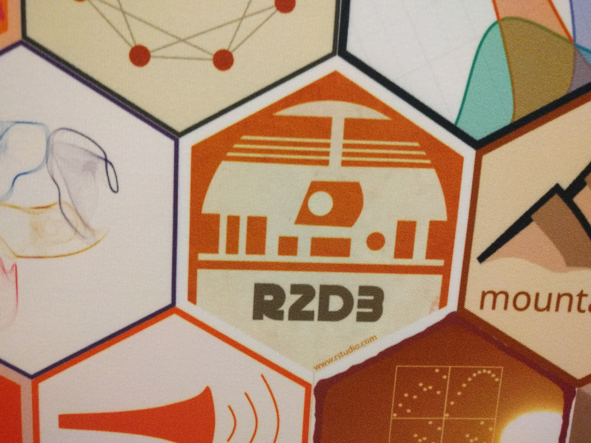
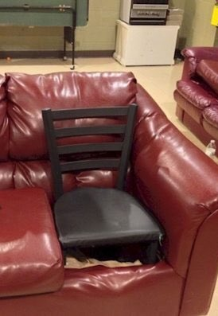

```{r setup, include=FALSE}
options(htmltools.dir.version = FALSE)
knitr::opts_chunk$set(cache = TRUE)
library(kableExtra)
```


class: center, middle

# David Neuzerling
## 2018-08-17

</img>

---
class: inverse, center, middle

</img>   </img>

Hex logos are the cutest part of R

---
class: inverse, center, middle

# R vs. Python


---
class: inverse, center, middle

#Refresh-R: Piping data
</img>

---
class: left
## Refresh-R: Ceci **est** pas une pipe

`%>%` is a *pipe*. It puts the object on the left into the *first* argument of
the function on the right:

* `4 %>% sqrt` is the same as `sqrt(4)`
* `data %>% head` is the same as `head(data)`

</img>

---
class: left
## Refresh-R: Ceci **est** pas une pipe

`%>%` is a *pipe*. It puts the object on the left into the *first* argument of
the function on the right:

* `4 %>% sqrt` is the same as `sqrt(4)`
* `data %>% head` is the same as `head(data)`

Or, if we wanted to calculate the average BMI of all droids in the Star Wars movies:

```{r starwars_piped, eval = FALSE}
starwars %>% 
    filter(species == "Droid") %>%
    mutate(BMI = mass / (height / 100)^2) %>% 
    summarise(avg_BMI = mean(BMI, na.rm = TRUE))
```

is the same as

```{r avg_droid_mass, eval = FALSE}
summarise(mutate(filter(starwars, species == "Droid"), BMI = mass / (height / 100)^2), avg_BMI = mean(BMI, na.rm = TRUE))
```

It's 32.7.

---
class: inverse, center, middle

#Refresh-R: Visualisation
</img>

---
class: center, middle

## Refresh-R: visualisation

```{r bomrang_plot_data, echo = FALSE, warning = FALSE, message = FALSE}
library(tidyverse)
library(bomrang)

weather <- get_historical(
    stationid = "090015",
    type = "max"
)
```

```{r bomrang_plot, echo = FALSE, warning = FALSE, message = FALSE}
weather_plot <- weather %>% 
    filter(!is.na(Max_temperature)) %>% # remove missing values  
    mutate(
        Season = case_when(
            Month %in% c(12, 1, 2) ~ "Summer",
            Month %in% c(3, 4, 5) ~ "Autumn",
            Month %in% c(6, 7, 8) ~ "Winter",
            Month %in% c(9, 10, 11) ~ "Spring"
        ),
        Season = factor(Season, levels = c("Summer", "Autumn", "Winter", "Spring")) # ordering
    ) %>%
    group_by(Year, Season) %>% 
    summarise(Average_max_temp = mean(Max_temperature)) %>% 
    ggplot(aes(x = Year, y = Average_max_temp)) +  
        facet_grid(Season ~ .) +
        geom_point() +
        geom_smooth() +
        ggtitle("Cape Otway Lighthouse seasonal temperatures")
```

```{r bomrang_plotly, echo = FALSE, warning = FALSE, message = FALSE}
library(plotly)
library(widgetframe)    
weather_plotly <- weather_plot %>% 
    ggplotly(height = 450) %>% 
    config(displayModeBar = F)
frameWidget(weather_plotly)
```

---
class: left
## Refresh-R: Visualisation

```{r bomrang_plot_data_code_1, eval = FALSE}
library(tidyverse)
library(bomrang)

weather <- get_historical(stationid = "090015", type = "max")
```

</img></img>

---
class: left
## Refresh-R: Visualisation

```{r bomrang_plot_data_code_2, eval = FALSE}
library(tidyverse)
library(bomrang)

weather <- get_historical(stationid = "090015", type = "max")
```

```{r bomrang_plot_data_head, eval = FALSE}
weather %>% sample_n(6)
```

```{r bomrang_plot_data_head_display, echo = FALSE}
weather %>% sample_n(6) %>% 
    knitr::kable(format = "html") %>% 
    kable_styling(font_size = 18)
```

---
class: left
## Refresh-R: Visualisation

```{r weather_code_1, eval = FALSE}
weather %>% 
    filter(!is.na(Max_temperature))
```

---
class: left
## Refresh-R: Visualisation

```{r weather_code_2, eval = FALSE}
weather %>% 
    filter(!is.na(Max_temperature)) %>%  
    mutate(
        Season = case_when(
            Month %in% c(12, 1, 2) ~ "Summer",
            Month %in% c(3, 4, 5) ~ "Autumn",
            Month %in% c(6, 7, 8) ~ "Winter",
            Month %in% c(9, 10, 11) ~ "Spring"
        ),
        Season = factor(Season, levels = c("Summer", "Autumn", "Winter", "Spring")) # ordering
    )
```

---
class: left
## Refresh-R: Visualisation

```{r weather_summarised, eval = TRUE}
weather %>% 
    filter(!is.na(Max_temperature)) %>%
    mutate(
        Season = case_when(
            Month %in% c(12, 1, 2) ~ "Summer",
            Month %in% c(3, 4, 5) ~ "Autumn",
            Month %in% c(6, 7, 8) ~ "Winter",
            Month %in% c(9, 10, 11) ~ "Spring"
        ),
        Season = factor(Season, levels = c("Summer", "Autumn", "Winter", "Spring")) # ordering
    ) %>%
    group_by(Year, Season) %>% 
    summarise(Average_max_temp = mean(Max_temperature)) -> weather_summarised
```

--
```{r weather_summarised_head_display, echo = FALSE}
weather_summarised %>% ungroup %>% sample_n(4) %>% 
    knitr::kable(format = "html") %>% 
    kable_styling(font_size = 18)
```

---
class: left
## Refresh-R: Visualisation

.pull-left[
```{r weather_partial_plot_code_1, eval = FALSE}
weather_summarised %>% 
    ggplot(
      aes(x = Year, y = Average_max_temp)
    )
```
]

.pull-right[
```{r weather_partial_plot_1, echo = FALSE, dpi = 300, fig.width = 5, fig.height = 5, out.height = 500, out.width = 500}
weather_summarised %>% 
    ggplot(
      aes(x = Year, y = Average_max_temp)
    )
```
]

---
class: left
## Refresh-R: Visualisation

.pull-left[
```{r weather_partial_plot_code_2, eval = FALSE}
weather_summarised %>% 
    ggplot(
      aes(x = Year, y = Average_max_temp)
    ) + 
    facet_grid(Season ~ .)
```
]

.pull-right[
```{r weather_partial_plot_2, echo = FALSE, dpi = 300, fig.width = 5, fig.height = 5, out.height = 500, out.width = 500}
weather_summarised %>% 
    ggplot(
      aes(x = Year, y = Average_max_temp)
    ) + 
    facet_grid(Season ~ .)
```
]

---
class: left
## Refresh-R: Visualisation

.pull-left[
```{r weather_partial_plot_code_3, eval = FALSE}
weather_summarised %>% 
    ggplot(
      aes(x = Year, y = Average_max_temp)
    ) + 
    facet_grid(Season ~ .) +
    geom_point() 
```
]

.pull-right[
```{r weather_partial_plot_3, echo = FALSE, dpi = 300, fig.width = 5, fig.height = 5, out.height = 500, out.width = 500, message = FALSE}
weather_summarised %>% 
    ggplot(
      aes(x = Year, y = Average_max_temp)
    ) + 
    facet_grid(Season ~ .) +
    geom_point() 
```
]

---
class: left
## Refresh-R: Visualisation

.pull-left[
```{r weather_partial_plot_code_4, eval = FALSE}
weather_summarised %>% 
    ggplot(
      aes(x = Year, y = Average_max_temp)
    ) +
    facet_grid(Season ~ .) +
    geom_point() +
    geom_smooth() 
```

We can pass this to plotly with the `ggplotly` function.
]

.pull-right[
```{r weather_partial_plot_4, echo = FALSE, dpi = 300, fig.width = 5, fig.height = 5, out.height = 500, out.width = 500, message = FALSE}
weather_summarised %>% 
    ggplot(
      aes(x = Year, y = Average_max_temp)
    ) +
    facet_grid(Season ~ .) +
    geom_point() +
    geom_smooth() 
```
]

---
class: inverse, center, middle

#Refresh-R: Modelling
</img>

---
class: left
## Refresh-R: Modelling

```{r diamonds_nrow}
diamonds %>% nrow
```

```{r diamonds_head, eval = FALSE}
diamonds %>% head
```

```{r diamonds_head_display, echo = FALSE}
diamonds %>% head %>% 
    knitr::kable(format = "html") %>% 
    kable_styling(font_size = 18)
```

---
class: left
## Refresh-R: Modelling

The `glance` function from the `broom` library makes model results tidy.
```{r broom, cache = FALSE, message = FALSE, warning = FALSE}
library(broom)
```

```{r diamonds_one_lm, eval = FALSE}
diamonds %>% 
    lm(price ~ color + carat + cut + clarity + depth + table, data = .) %>% 
    glance
```

```{r diamonds_one_display, echo = FALSE}
diamonds %>% 
    lm(price ~ color + carat + cut + clarity + depth + table, data = .) %>%
    glance %>% 
    knitr::kable(format = "html") %>% 
    kable_styling(font_size = 16)
```

</img>

---
class: left
## Refresh-R: Modelling

Suppose we wanted to make a different model for every `color`.

`glance` gives one row per model.

```{r diamonds_many_lm, eval = FALSE}
diamonds %>% 
    group_by(color) %>% 
    do(glance(lm(price ~ carat + cut + clarity + depth + table, data = .)))
```

```{r diamonds_many_display, echo = FALSE}
diamonds %>% 
    group_by(color) %>% 
    do(glance(lm(price ~ carat + cut + clarity + depth + table, data = .))) %>% 
    knitr::kable(format = "html") %>% 
    kable_styling(font_size = 16)
```

---
class: left
## Refresh-R: Modelling

We can use the `augment` function from the `broom` package to get 
*observation-level* statistics for our linear models.

```{r diamonds_augment_lm, eval = FALSE}
diamonds %>% 
    group_by(color) %>% 
    do(augment(lm(price ~ carat + cut + clarity + depth + table, data = .))) %>% 
    head
```

```{r diamonds_augment_display, echo = FALSE}
diamonds %>% 
    group_by(color) %>% 
    do(augment(lm(price ~ carat + cut + clarity + depth + table, data = .))) %>%
    head %>% 
    knitr::kable(format = "html") %>% 
    kable_styling(font_size = 16)
```

According to these models, some diamonds have... negative prices?


---
class: left
## Refresh-R: Modelling

```{r diamonds_ggplot, eval = FALSE}
diamonds %>% 
    group_by(color) %>% 
    do(augment(lm(price ~ carat + cut + clarity + depth + table, data = .))) %>%
    ggplot(aes(x = .fitted, y = .resid)) +
        geom_hline(yintercept = 0) +
        geom_point() + 
        facet_wrap(color ~ ., ncol = 2)
```

---
class: center
## Refresh-R: Modelling

```{r diamonds_ggplot_display, echo = FALSE, message = FALSE, warning = FALSE, dpi = 300, fig.width = 10, fig.height = 5, out.height = 500, out.width = 1000}

diamonds %>% 
    group_by(color) %>% 
    do(augment(lm(price ~ carat + cut + clarity + depth + table, data = .))) %>%
    ggplot(aes(x = .fitted, y = .resid)) +
        geom_hline(yintercept = 0) +
        geom_point() + 
        facet_wrap(color ~ ., ncol = 2)
```

---
class: center
## Refresh-R: Modelling

.pull-left[
```{r diamond_unmodified, echo = FALSE, message = FALSE, warning = FALSE, dpi = 300, fig.width = 5, fig.height = 5, out.height = 500, out.width = 500}

diamonds %>% 
    ggplot(aes(x = carat, y = price)) + 
    geom_point() + 
    ggtitle("Unmodified")
```
]

.pull-right[
```{r diamond_modified, echo = FALSE, message = FALSE, warning = FALSE, dpi = 300, fig.width = 5, fig.height = 5, out.height = 500, out.width = 500}

diamonds %>% 
    ggplot(aes(x = log(carat), y = log(price))) + 
    geom_point() + 
    ggtitle("Log-transformed")
```
]

---
class: inverse, center, middle
# Modifying data


https://xkcd.com/1838/

---
class: left
## Modifying data

* Centering
* Scaling
* Filters
* PCA
* Encoding/decoding
* Missing value imputation
* Feature engineering

```{r library_recipes, cache = FALSE, warning = FALSE, message = FALSE}
library(recipes)
```

</img>

---
## `ames` housing data

.pull-left[
```{r ames_data, include = FALSE}
ames <- AmesHousing::make_ames()
```

```{r ames_leaflet, warning = FALSE, message = FALSE, eval = FALSE}
library(leaflet)

leaflet(ames) %>% 
    addTiles() %>% 
    addCircleMarkers(radius = 1)
```
]

.pull-right[
```{r ames_leaflet_code, echo = FALSE, message = FALSE, warning = FALSE, out.height = 420, out.width = 420}
library(leaflet)

leaflet(ames) %>% 
    addTiles() %>% 
    addCircleMarkers(radius = 1)
```
]

---
## Infrequently occurring levels

.pull-left[
```{r neighbourhood_plot_code, eval = FALSE}
ames %>% 
    ggplot(aes(x = Neighborhood)) +
    geom_bar(
        fill = "#6d1e3b", 
        colour = "white"
    ) + 
    coord_flip()
```    
]

.pull-right[
```{r neighbourhood_plot, echo = FALSE, dpi = 300, fig.width = 5, fig.height = 5, out.height = 500, out.width = 500}
ames %>% 
    ggplot(aes(x = Neighborhood)) +
    geom_bar(
        fill = "#6d1e3b", 
        colour = "white"
    ) + 
    coord_flip()
``` 
]

---
## Non-normally distributed data

.pull-left[
```{r lot_area_plot_code, eval = FALSE}
ames %>% 
    ggplot(aes(x = Lot_Area)) + 
    geom_density() + 
    xlim(0, 30000)
```    
]

.pull-right[
```{r lot_area_plot, warning = FALSE, echo = FALSE, dpi = 300, fig.width = 5, fig.height = 5, out.height = 500, out.width = 500}
ames %>% 
    ggplot(aes(x = Lot_Area)) + 
    geom_density() + 
    xlim(0, 30000)
``` 
]

---
## Preparing and baking a recipe

```{r data_split_1, message = FALSE, warning = FALSE}
library(rsample)
data_split <- initial_split(ames, strata = "Sale_Price", p = 0.75)
ames_train <- training(data_split)
ames_test <- testing(data_split)
```

</img>

---
## Preparing and baking a recipe

```{r data_split_2, eval = FALSE}
library(rsample)
data_split <- initial_split(ames, strata = "Sale_Price", p = 0.75)
ames_train <- training(data_split)
ames_test <- testing(data_split)
```

```{r recipe}
recipe(
        Sale_Price ~ Longitude + Latitude + Neighborhood + Lot_Area, 
        data = ames_train
    ) %>% 
    step_other(Neighborhood, threshold = 0.05) %>%
    step_log(Sale_Price, base = 10) %>%
    step_YeoJohnson(Lot_Area) %>% 
    prep(training = ames_train) -> ames_recipe
```

--

```{r recipe_baking}
ames_train_baked <- ames_recipe %>% bake(ames_train)
ames_test_baked <- ames_recipe %>% bake(ames_test)
```

---
## Linear models

```{r ames_lms, include = FALSE}
ames_lm <- lm(
    Sale_Price ~ Longitude + Latitude + Neighborhood + Lot_Area,
    data = ames_train
)

ames_baked_lm <- lm(
    Sale_Price ~ Longitude + Latitude + Neighborhood + Lot_Area,
    data = ames_train_baked
)
```

.pull-left[
```{r ames_unmodified_lm, warning = FALSE, message = FALSE, echo = FALSE, dpi = 300, fig.width = 5, fig.height = 5, out.height = 500, out.width = 500}
ames_lm %>% ggplot(aes(.fitted, .resid)) +
    geom_hline(yintercept = 0) +
    geom_point() +
    geom_smooth(se = FALSE) +
    xlim(0, 400000) + 
    ggtitle("Unmodified data")
```
]

.pull-right[
```{r ames_modified_lm, warning = FALSE, message = FALSE, echo = FALSE, dpi = 300, fig.width = 5, fig.height = 5, out.height = 500, out.width = 500}
ames_baked_lm %>% ggplot(aes(.fitted, .resid)) +
    geom_hline(yintercept = 0) +
    geom_point() +
    geom_smooth(se = FALSE) +
    ggtitle("Modified data")
```
]

---
class: inverse, middle, center

# Missing values

</img>

Mean value imputation

---
## Ozone data

.pull-left[
```{r naniar_code, eval = FALSE}
library(naniar)
ozone <- read_csv("ozoneNA.csv") %>% 
    select(-X1, -WindDirection)
vis_miss(ozone)
```

</img>

]

.pull-right[
```{r naniar_plot, warning = FALSE, message = FALSE, echo = FALSE, dpi = 300, fig.width = 5, fig.height = 5, out.height = 500, out.width = 500}
library(naniar)
ozone <- read_csv("data/ozoneNA.csv") %>% 
    select(-X1, -WindDirection)
vis_miss(ozone, cluster = TRUE)
```
]

---
class: middle, center
## Visualising missing data

```{r feed_data, include = FALSE}
feed <- "data/feed.csv" %>% read_csv 
```
  
```{r feed_visdat, echo = FALSE, warning = FALSE, message = FALSE, echo = FALSE, dpi = 300, fig.width = 10, fig.height = 5, out.height = 500, out.width = 1000}
feed %>% visdat::vis_dat(warn_large_data = FALSE)
```

---
class: inverse, center, middle
# Time series

</img>

---
class: left
## `fable`

```{r library_fable, warning = FALSE, message = FALSE}
library(tsibble) 
library(fable) 
```

```{r cafe_data, eval = FALSE, warning = FALSE, message = FALSE}
cafe <- fpp2::auscafe %>% as_tsibble
cafe %>% head
```

.pull-left[
```{r cafe_data_display, echo = FALSE}
cafe  <- fpp2::auscafe %>% as_tsibble
cafe %>% head %>% 
    knitr::kable(format = "html") %>% 
    kable_styling(font_size = 18)
```
]

.pull-right[
</img></img>
]

---
class: left
## `fable`

```{r fable_plot, warning = FALSE, message = FALSE, echo = TRUE, dpi = 300, fig.height = 4, fig.width = 10, out.height = 400, out.width = 1000}
# Example by Rob Hyndman
cafe %>% ARIMA(log(value) ~ pdq(2, 1, 1) + PDQ(2, 1, 2)) %>% forecast() %>% autoplot()
```

---
class: inverse, center, middle

</img>
