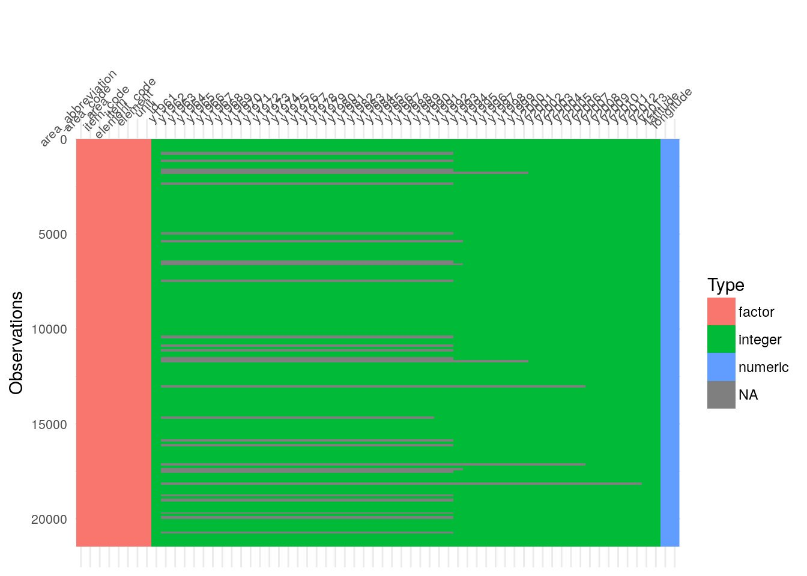

```{r setup, include=FALSE}
options(htmltools.dir.version = FALSE)
knitr::opts_chunk$set(cache = TRUE)
library(tidyverse)
```


class: center, middle

# David Neuzerling
## 2018-08-17

</img>

---
class: inverse, center, middle

</img>   </img>

---
class: inverse, center, middle

# R vs. Python

<iframe src="https://giphy.com/embed/sbZzn5lAsQRAk" width="480" height="270" frameBorder="0" class="giphy-embed" allowFullScreen></iframe>

---
class: center, middle

</img>

---
class: center, middle

</img>  

---
class: left

## Modifying data with recipes

* Centering
* Scaling
* Filters
* PCA
* Encoding/decoding
* Missing value imputation
* Feature engineering

```{r library_recipes, warning = FALSE, message = FALSE}
library(recipes)
```

---
## `ames` housing data

.pull-left[
```{r ames_data, include = FALSE}
ames <- AmesHousing::make_ames()
```

```{r ames_leaflet, warning = FALSE, message = FALSE, eval = FALSE}
library(leaflet)

colour_palette <- colorNumeric(
    palette = colorRampPalette(
            c('yellow', 'red')
        )(length(ames$Sale_Price)), 
    domain = ames$Sale_Price
)

leaflet(ames) %>% 
    addTiles() %>% 
    addCircleMarkers(
        radius = 2, 
        color = colour_palette(
            ames$Sale_Price
        )
    )
```
]

.pull-right[
```{r ames_leaflet_code, echo = FALSE, message = FALSE, warning = FALSE, out.height = 420, out.width = 420}
library(leaflet)

colour_palette <- colorNumeric(
  palette = colorRampPalette(c('yellow', 'red'))(length(ames$Sale_Price)), 
  domain = ames$Sale_Price
)

leaflet(ames) %>% 
    addTiles() %>% 
    addCircleMarkers(radius = 1, color = colour_palette(ames$Sale_Price))
```
]

---
## Infrequently occurring levels

.pull-left[
```{r neighbourhood_plot_code, eval = FALSE}
ames %>% 
    ggplot(aes(x = Neighborhood)) +
    geom_bar(
        fill = "#6d1e3b", 
        colour = "white"
    ) + 
    coord_flip()
```    
]

.pull-right[
```{r neighbourhood_plot, echo = FALSE, dpi = 300, out.height = 420, out.width = 420}
ames %>% 
    ggplot(aes(x = Neighborhood)) +
    geom_bar(
        fill = "#6d1e3b", 
        colour = "white"
    ) + 
    coord_flip()
``` 
]

---
## Non-normally distributed data

.pull-left[
```{r lot_area_plot_code, eval = FALSE}
ames %>% 
    ggplot(aes(x = Lot_Area)) + 
    geom_density() + 
    xlim(0, 30000)
```    
]

.pull-right[
```{r lot_area_plot, warning = FALSE, echo = FALSE, dpi = 300, out.height = 420, out.width = 420}
ames %>% 
    ggplot(aes(x = Lot_Area)) + 
    geom_density() + 
    xlim(0, 30000)
``` 
]

---
## Preparing and baking a recipe

```{r data_split, message = FALSE, warning = FALSE}
library(rsample)
data_split <- initial_split(ames, strata = "Sale_Price", p = 0.75)
ames_train <- training(data_split)
ames_test <- testing(data_split)
```

--

```{r recipe}
recipe(
        Sale_Price ~ Longitude + Latitude + Neighborhood + Lot_Area, 
        data = ames_train
    ) %>% 
    step_other(Neighborhood, threshold = 0.05) %>%
    step_log(Sale_Price, base = 10) %>%
    step_YeoJohnson(Lot_Area) %>% 
    prep(training = ames_train) -> ames_recipe
```

--

```{r recipe_baking}
ames_train_baked <- ames_recipe %>% bake(ames_train)
ames_test_baked <- ames_recipe %>% bake(ames_test)
```

---
## Linear models

```{r ames_lms, include = FALSE}
ames_lm <- lm(
    Sale_Price ~ Longitude + Latitude + Neighborhood + Lot_Area,
    data = ames_train
)

ames_baked_lm <- lm(
    Sale_Price ~ Longitude + Latitude + Neighborhood + Lot_Area,
    data = ames_train_baked
)
```

.pull-left[
```{r ames_unmodified_lm, warning = FALSE, message = FALSE, echo = FALSE, dpi = 300, out.height = 420, out.width = 420}
ames_lm %>% ggplot(aes(.fitted, .resid)) +
    geom_hline(yintercept = 0) +
    geom_point() +
    geom_smooth(se = FALSE) +
    xlim(0, 400000) + 
    ggtitle("Unmodified data")
```
]

.pull-right[
```{r ames_modified_lm, warning = FALSE, message = FALSE, echo = FALSE, dpi = 300, out.height = 420, out.width = 420}
ames_baked_lm %>% ggplot(aes(.fitted, .resid)) +
    geom_hline(yintercept = 0) +
    geom_point() +
    geom_smooth(se = FALSE) +
    ggtitle("Modified data")
```
]

---
class: inverse, middle, center

# Missing value imputation

</img>

---
class: middle, center
## Visualising missing data

</img>

---
## Ozone data

.pull-left[
```{r naniar_code, eval = FALSE}
library(naniar)
ozone <- read_csv("ozoneNA.csv") %>% 
    select(-X1, -WindDirection)
vis_miss(ozone)
```
]

.pull-right[
```{r naniar_plot, warning = FALSE, message = FALSE, echo = FALSE, dpi = 300, out.height = 420, out.width = 420}
library(naniar)
ozone <- read_csv("data/ozoneNA.csv") %>% 
    select(-X1, -WindDirection)
vis_miss(ozone, cluster = TRUE)
```
]
